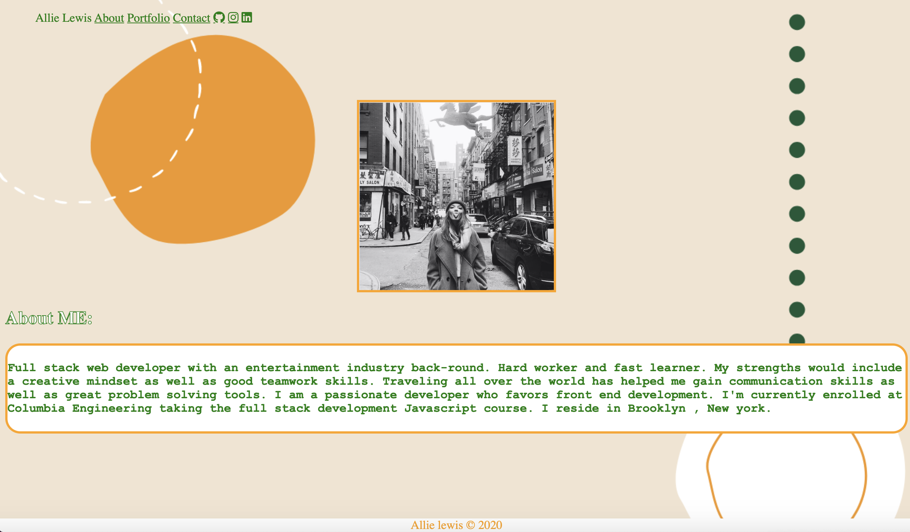
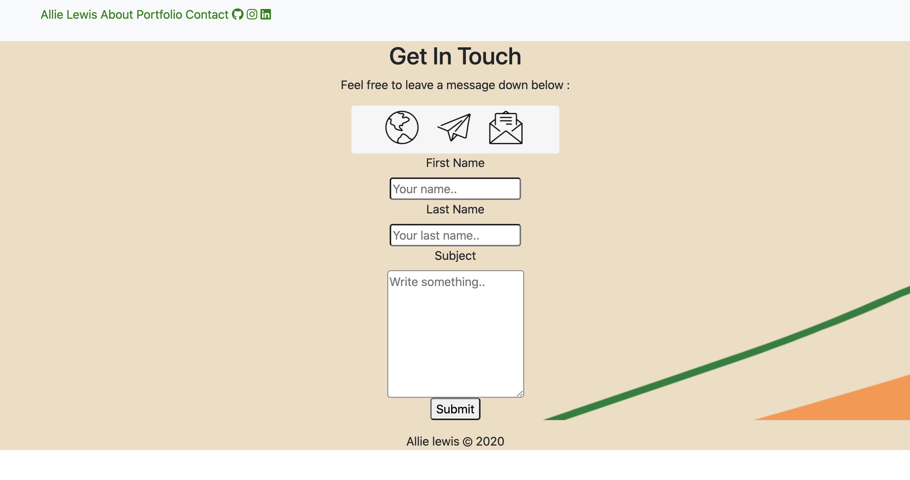
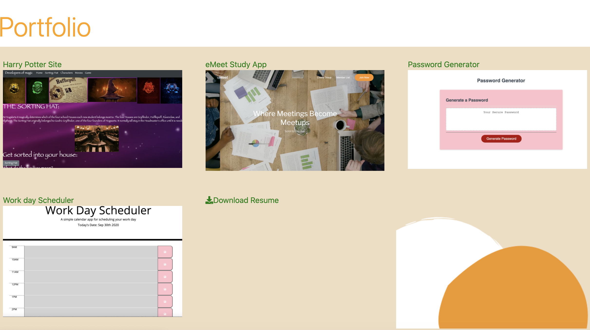

## Responsive-Portfolio-
## Description
 I created a Responsive Portfolio to demonstrate my work throughout developing. This site you'll be able to go to an About me, Contact sheet, and a portfolio page with links to sites i've created. On this same page there is a link where you can download my resume.
Navigate through the README Using the Table of Contents : 
* [Installation](#Installation)
* [Usage](#Usage)
* [License](#License)
* [Contributions](#Contributions)
* [Tests](#Tests)
* [Questions](#Questions)
## Installation 
*Bootstrap
*Css
*HTML
## Usage
Homework
## License

## Contributors
No Other Contributers
## Tests
No
## Questions
[Link to Creator Github](https://github.com/Allielewis07)
 Project examples:
 
 
 
